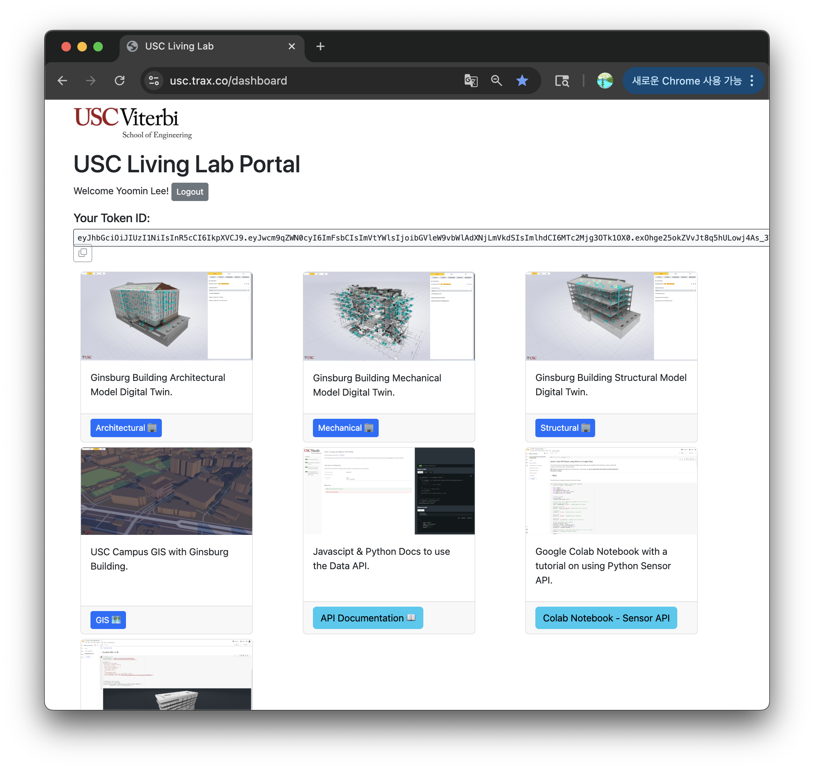
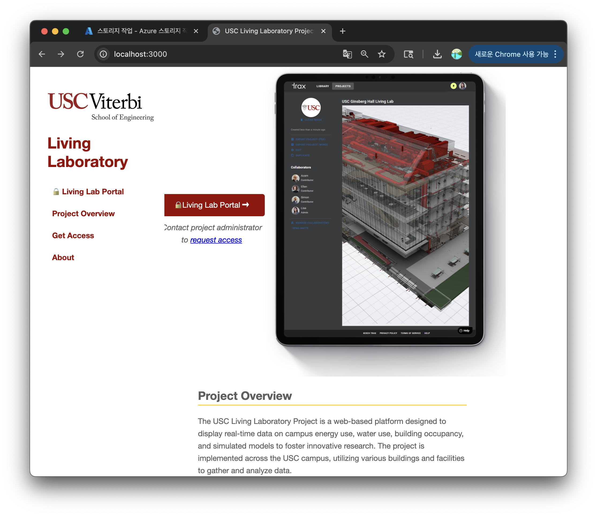

<!-- # HPCS -->

# Living Lab Research Extensions for the Digital Twin Platform

This document describes an ongoing research effort to **use and extend an existing digital twin platform** in the context of a building-scale **Living Lab**.

The goal is to configure the current stack (API server, OPC clients, Azure storage) for a real academic building and to make it easier for researchers to run **long-term, data-driven studies** (e.g., sustainability, human–building interaction, and AI/ML on building data).

<!-- > NOTE: This work builds on a pre-existing digital twin codebase that is licensed under a **Research-Use-Only ShareAlike License (RUL-SA) v1.3**.  
> All activities described here are strictly non-commercial and respect the original license. -->

---

## 1. Project Overview

### What this project is

- Configure the existing **digital twin services** (Node.js API, OPC UA clients, Azure Blob Storage ingestion) for a specific **Living Lab building** (new CS building).
- Provide a **research-friendly layer** on top
  <!-- - Clear configuration docs for bringing up a dev/research stack
  - Stable sensor and roll-up data exposed through documented APIs
  - Example notebooks for analysis and AI/ML exploration -->

<!-- The intent is **not** to rewrite the core platform, but to:

1. Bring it up reliably for a new building, and  
2. Add the minimum tooling needed so researchers can actually use the data. -->

---

## 2. Current Status 

We are currently in an **early setup and familiarization phase**.

- **Repository access**
  - Connecting my Azure storage with code.
  - you can see the code at : https://github.com/yoominlee/living-lab
  - Overview of the repository: 
    - `src/api`: Node.js/Express API server for sensor data and authentication
    - `src/opc-client`: Node.js OPC UA client for data ingestion to Azure
    - `src/TraxOPCClient`: .NET OPC client library and examples

- **Environment setup**
  - Setting up local development environment with:
    - Node.js (v16+), npm
    - Docker & Docker Compose
    - .NET SDK / Mono (if needed for OPC DA testing)
  - Preparing initial `.env` files for:
    - `src/api` (API server configuration)
    - `src/opc-client` (OPC UA and Azure configuration)

- **Initial bring-up**
  - Target short-term checks:
    - Run the API server in development mode
    - Run the OPC client against a test or staging OPC UA endpoint
    - Verify that sensor data can be ingested into a test Azure storage account

At this stage, the focus is on **understanding the system and running it safely**, without changing core behavior.

---

## 3. Next Steps (Technical Setup)

In the near term, the goals are:

- Establish a **minimal dev/research deployment**:
  - API server running locally or via `docker-compose`
  - OPC client running as a service and writing to Azure Blob Storage
- Make a research friendly layer on top of the portal.
<!-- - Document a **short “Getting Started for Researchers” guide**:
  - How to start the stack (local and/or Docker)
  - How to configure `.env` files (without secrets)
  - How to hit a simple sensor-data endpoint -->

This will provide a stable base on which we can layer research tools.

---

## 4. Planned Research-Facing Extensions

Once the basic stack is confirmed to be stable for the Living Lab building, we plan to add **lightweight research-facing extensions**:

- **Data/schema documentation**
  - Describe how sensor time series, device metadata, and building hierarchy are stored
  - Provide examples of common queries (by device, by room, by floor, by time range)

- **Example notebooks**
  - A small set of Jupyter/Colab notebooks under a `research/` or `notebooks/` directory, showing:
    - How to fetch sensor data via the API
    - How to work with roll-up data for trend/seasonality analysis
    - A few basic plots for temperature, CO₂, etc.

The principle here is to **add the minimum helpful layer** for researchers, without over-complicating the core platform.

---

## 5. Longer-Term Research Directions

With the platform configured as a Living Lab backend, the longer-term goal is to explore **research questions** on top of the building data, for example:

- **Comfort & energy modeling**
  - Learn relationships between occupancy, temperature, CO₂, and energy use.
  - Explore data-driven comfort/energy trade-offs.

- **Anomaly detection & fault diagnostics**
  - Detect unusual sensor behavior, misconfigurations, or equipment issues.
  - Visualize anomalies in the context of building zones and systems.

- **AI agents on top of the API**
  - *Comfort agent*: propose small, safe setpoint changes based on long-term data.
  - *Explainable building chatbot*: answer questions like “Why is this room cold today?” using sensor and operational data.
  - *Occupancy coach*: recommend less crowded, more comfortable spaces when additional occupancy data sources (e.g., WiFi logs) are available.
- **Hierarchical building management & decision support**
  - Use the digital twin’s hierarchy (building → floor → zone → room → device) to compute multi-level health, comfort, and energy KPIs.
  - Build operator-facing dashboards that aggregate issues and recommendations at each level (e.g., “problematic zones on floor 3”) instead of only looking at individual sensor points.
  - Explore rule-based and ML-based strategies for prioritizing alarms, maintenance actions, and setpoint changes using this hierarchy.

These are **research applications** that use the platform as infrastructure;  
they do not require modifying the core ingestion or storage logic.

---